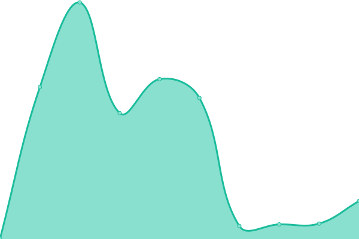

# [📈 Live Status](https://status.ossmxun.net): <!--live status--> **🟥 Complete outage**

This repository contains the open-source uptime monitor and status page for [oSsmXun](https://status.ossmxun.net), powered by [Upptime](https://github.com/upptime/upptime).

With [Upptime](https://upptime.js.org), you can get your own unlimited and free uptime monitor and status page, powered entirely by a GitHub repository. We use [Issues](https://github.com/oSsmXun256/status/issues) as incident reports, [Actions](https://github.com/oSsmXun256/status/actions) as uptime monitors, and [Pages](https://status.ossmxun.net) for the status page.

<!--start: status pages-->
<!-- This summary is generated by Upptime (https://github.com/upptime/upptime) -->
<!-- Do not edit this manually, your changes will be overwritten -->
<!-- prettier-ignore -->
| URL | Status | History | Response Time | Uptime |
| --- | ------ | ------- | ------------- | ------ |
|  [Website](https://ossmxun.net) | 🟥 Down | [website.yml](https://github.com/oSsmXun256/status/commits/HEAD/history/website.yml) | 

 278ms
     
 | 

<a href="https://status.ossmxun.net/history/website">61.88%</a>
    

|  [oSsmXun API](https://api.ossmxun.net/health) | 🟥 Down | [o-ssm-xun-api.yml](https://github.com/oSsmXun256/status/commits/HEAD/history/o-ssm-xun-api.yml) | 

 248ms
     
 | 

<a href="https://status.ossmxun.net/history/o-ssm-xun-api">61.88%</a>
    

|  [oSsmXun Dashboard](https://dashboard.ossmxun.net) | 🟥 Down | [o-ssm-xun-dashboard.yml](https://github.com/oSsmXun256/status/commits/HEAD/history/o-ssm-xun-dashboard.yml) | 

 495ms
     
 | 

<a href="https://status.ossmxun.net/history/o-ssm-xun-dashboard">61.88%</a>
    

|  [File Server 1](https://fs1.ossmxun.net) | 🟥 Down | [file-server-1.yml](https://github.com/oSsmXun256/status/commits/HEAD/history/file-server-1.yml) | 

 426ms
     
 | 

<a href="https://status.ossmxun.net/history/file-server-1">61.88%</a>
    

|  [File Server 2](https://fs2.ossmxun.net) | 🟥 Down | [file-server-2.yml](https://github.com/oSsmXun256/status/commits/HEAD/history/file-server-2.yml) | 

 375ms
     
 | 

<a href="https://status.ossmxun.net/history/file-server-2">61.71%</a>
    

<!--end: status pages-->

[**Visit our status website →**](https://status.ossmxun.net)

## 📄 License

- Powered by: [Upptime](https://github.com/upptime/upptime)
- Code: [MIT](./LICENSE) © [Anand Chowdhary](https://anandchowdhary.com), supported by [Pabio](https://pabio.com)
- Data in the `./history` directory: [Open Database License](https://opendatacommons.org/licenses/odbl/1-0/)
